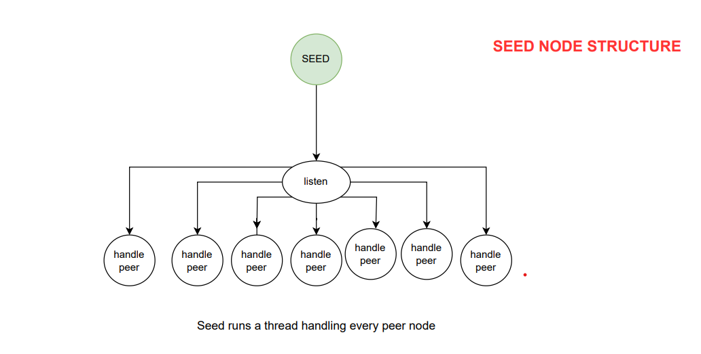
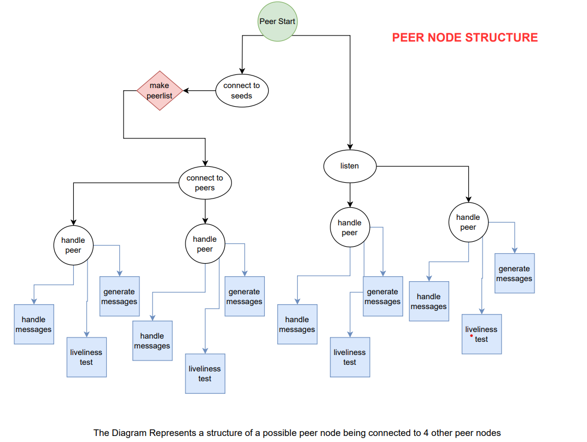

# Peer-to-Peer Network

This project is a simple implementation of a peer-to-peer network with a seed node. The seed node maintains a list of active peers and provides this list to any peer that requests it. The peers can then communicate directly with each other.

## Files

- `peer.py`: This file contains the `Peer` class which is responsible for handling the peer nodes in the network. It includes methods for connecting to seeds and peers, handling messages, and performing liveness tests.

- `seed.py`: This file contains the `Seed` class which is responsible for handling the seed node in the network. It includes methods for listening to incoming connections and handling peers.

- `seedspawner.py`: This file is used to start multiple seed nodes from ports starting from 5000. It will ask for the number of seed nodes to start.
- `config.txt`: This file contains the IP addresses and ports of the seed nodes in the network.

- `outputfile.log`: This file is used for logging.


## Features

- **Seed Node**: The seed node maintains a list of active peers and provides this list to any peer that requests it.

- **Peer Node**: The peer nodes can connect to the seed node to get a list of active peers. They can then communicate directly with these peers.

- **Liveness Test**: The peer nodes periodically send liveness requests to check if the other nodes are still active.

- **Message Generation and Handling**: The peer nodes can generate and send messages to other peers. They can also handle incoming messages.

Please note that this is a simple implementation and may not include all the features of a full-fledged peer-to-peer network.

## How to run
There are two methods to run the code
## method 1 (RECOMMENDED)
1. Run the `seedspawner.py` file to start the seed node. It will automatically start multiple seed nodes from ports starting from 5000 .It will ask for the number of seed nodes to start.(you can change this if that port is busy on your machine.)
2. run `peer.py` file every time you want to start a peer node. It will ask for the port number to connect to, you can enter any port number.(IP address is hardcoded to localhost you can change it in the code in demo mode if you want to run it on a different machine you can easily change it.However, The Seed or Peer class is not hardcoded to localhost it can run on any ip. It can be run on any machine.)q

## method 2
1. Run the seed node manually by running the `seed.py` file. but you have to clear the `outputfile.log` file and `config.log` before running the first seed node.

2. Run the peer node manually by running the `peer.py` file.

both will ask for the port number to connect to, you can enter any port number.(IP address is hardcoded to localhost you can change it in the code in demo mode if you want to run it on a different machine you can easily change it.However, The Seed or Peer class is not hardcoded to localhost it can run on any ip. It can be run on any machine.)


## Usage

To start a seed node, run the `seed.py` file and enter the port to connect to when prompted:

```sh
python seed.py
```
To start a peer node, run the `peer.py` file and enter the port to connect to when prompted:

```sh
python peer.py
```

## Structure
The structure in the terms of thread/code is as follows:

Structure of the Seed Node:


Structure of the Peer Node:


## Code Explanation
# seed.py

The `seed.py` file contains the `Seed` class, which is responsible for handling the seed node in the network. The seed node maintains a list of active peers and provides this list to any peer that requests it. 

The `Seed` class has the following methods:

- `__init__(self, port=12345, ip='localhost')`: This is the constructor of the `Seed` class. It initializes the seed node with the given IP address and port number, and creates a new socket for the seed node.

- `config_entry(self)`: This method checks if the seed node is already present in the `config.txt` file. If not, it adds the seed node to the file.

- `listen(self)`: This method makes the seed node listen for incoming connections. When a peer node connects to the seed node, it starts a new thread to handle the peer node.

- `handle_peer(self, peer, addr)`: This method handles the communication with a peer node. It receives messages from the peer node and responds accordingly.


# Peer.py
# Peer.py

The `Peer.py` script is responsible for managing the peer-to-peer network. It starts with the `self.start` function which initiates two threads:

1. **Listening Thread**: This thread is responsible for listening to other peer nodes. When a connection is established, it starts a new thread to handle the communication with the connected peer node.
handles the communication with the connected peer by calling the `handle_peer` function.

2. **Seed Connection Thread**: This thread is responsible for connecting to the seed nodes(using `connect to seeds`).After that It retrieves the peer list from each connected seed node (all of this is done in `handle_seeds` function). After retrieving the peer lists, it performs a union operation to create a comprehensive list of available peers in the network.Then it makes a call to `connect_to_peers` function to connect to the peers.


The `connect_to_peers` function is responsible for establishing connections with other peers in the network. It performs the following steps:

1. Randomly selects up to 4 peers from the available peers list.
2. For each selected peer, it checks if the peer is not the same as the current peer. If it is the same, it skips to the next peer.
3. It creates a new socket and tries to connect to the peer.
4. If the connection is successful, it adds the socket to the list of sockets connected to peers (`self.sockets_to_peers`).
5. It then starts a new thread to handle the communication with the connected peer by calling the `handle_peer` function.
6. If the connection fails, it prints an error message and continues with the next peer.

## handle_peer function

The `handle_peer` function is responsible for managing the communication with a connected peer. For each connected peer, it starts three separate threads:

1. **Handle Messages Thread**: This thread runs the `handle_messages` method. This method is responsible for continuously listening for and processing incoming messages from the connected peer and forwarding of the gossip messages to other peers as well as responding to the liveness requests.

2. **Liveness Test Thread**: This thread runs the `liveness_test` method. This method periodically sends a liveness request to the connected peer to check if it's still active. If a reply is not received within a certain time, the peer is considered inactive and reported as deadnode.

3. **Gossip Thread (Generate Messages)**: This thread runs the `generate_messages` method. This method periodically sends a gossip message to the connected peer. 

These threads allow the peer to handle multiple tasks concurrently for each connected peer, ensuring efficient communication and network management.
